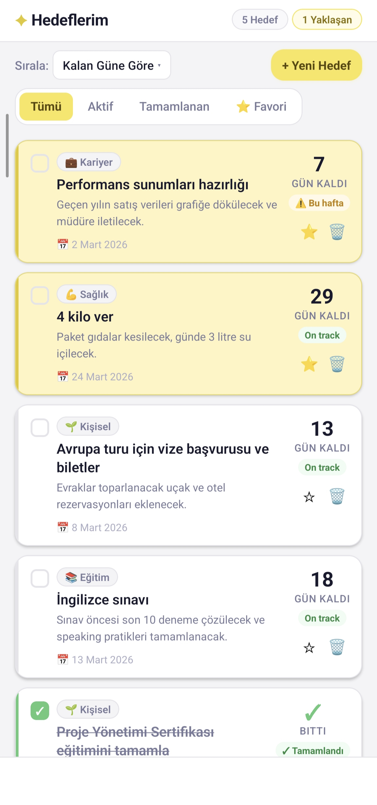
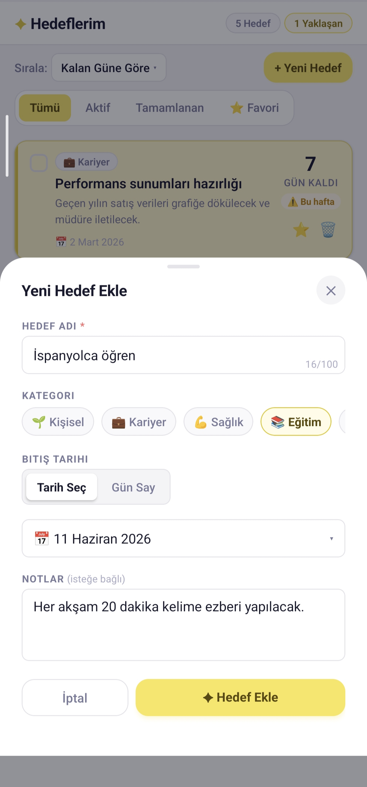
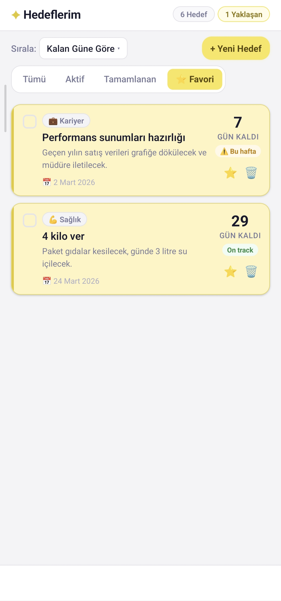
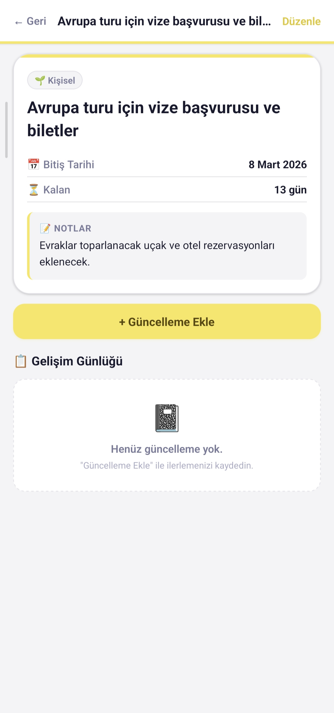
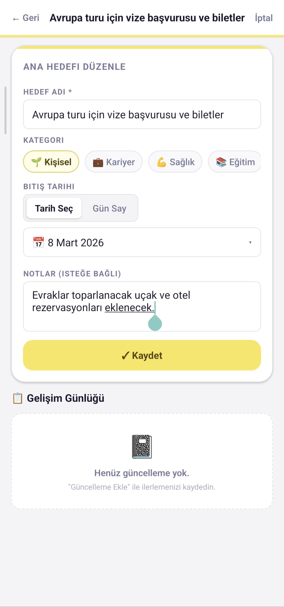
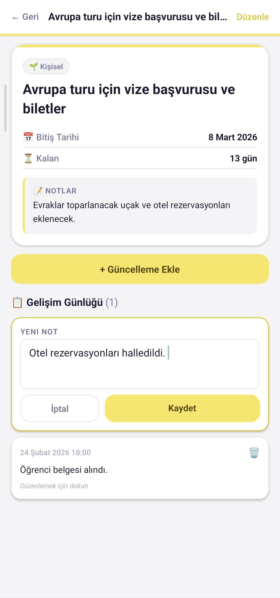
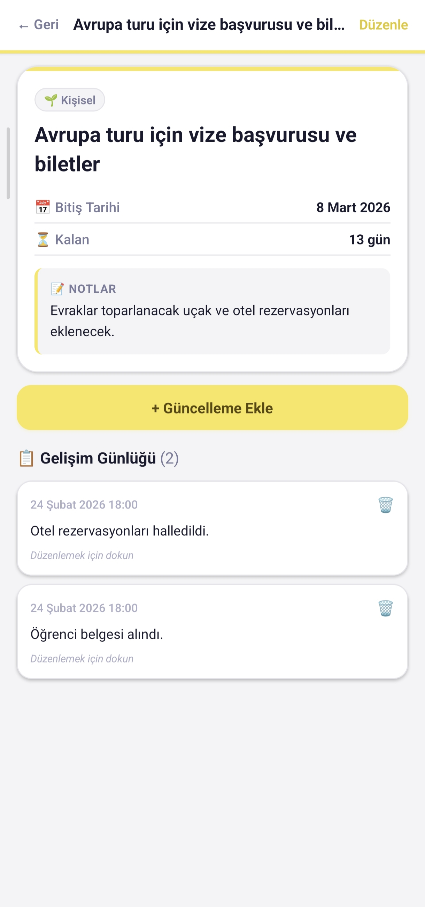

# Goal Tracker App

A minimalist React Native app for tracking personal goals. Create goals with categories and deadlines, log your progress, and stay on top of what matters.

---

## Screenshots

<p align="center">
  
  
  
  
</p>
<p align="center">
  
  
  
</p>

---

## Features

- **Add Goals** — Create goals with a name, category, deadline, and description
- **Date Mode** — Pick a date from the calendar or enter "how many days from now"
- **Categories** — Personal, Career, Health, Education, Finance, Relationships, Hobby
- **Subtasks** — Break goals into smaller steps and track completion
- **Progress Journal** — Add progress notes to each goal
- **Sort & Filter** — Sort by days remaining, date, category, or name; filter by active/completed/pinned
- **Search** — Quickly find goals by name or description
- **Pin** — Pin important goals to the top
- **Swipe Actions** — Swipe right to complete, swipe left to delete
- **Recurring Goals** — Daily, weekly, monthly or custom repeat cycles
- **Reminders** — Schedule local notifications before the deadline (choose 1, 3, 7 days or a custom number)
- **Dark Mode** — Full light and dark theme support
- **Calendar View** — See all goal deadlines on a monthly calendar
- **Stats** — Overview of completion rate and category breakdown
- **Onboarding** — First-time user guide built into the empty state
- **Persistent Storage** — Data saved with AsyncStorage across app restarts
- **Multi-language** — Turkish, English, Simplified Chinese, Japanese, and Korean
- **Google Ads** — Banner ad support

---

## Tech Stack

| Package | Version |
|---------|---------|
| React Native | 0.81.5 |
| Expo | ~54.0.33 |
| React | 19.1.0 |
| AsyncStorage | ^2.2.0 |
| DateTimePicker | ^8.6.0 |
| expo-notifications | ~0.32.16 |
| Google Mobile Ads | ^16.0.3 |

---

## Supported Languages

| Code | Language | Script / Notes |
|------|----------|----------------|
| `tr` | Turkish | — |
| `en` | English | — |
| `zh` | Chinese | Simplified (zh-CN) |
| `ja` | Japanese | Hiragana, Katakana & Kanji |
| `ko` | Korean | Hangul |

---

## Getting Started

```bash
# Install dependencies
npm install

# Start with Expo
npx expo start

# Android
npx expo start --android
```

> Requires an Android device or emulator.

---

## Project Structure

```
hedefapp/
├── App.js                          # Root component, state management
├── src/
│   ├── components/
│   │   ├── AddGoalModal.js         # Bottom-sheet modal for adding goals
│   │   ├── GoalDetailModal.js      # Goal detail & progress journal
│   │   ├── GoalCard.js             # Swipeable list card
│   │   ├── AppHeader.js            # Top header bar
│   │   ├── ControlsBar.js          # Sort & add controls
│   │   ├── FilterTabs.js           # Filter tab bar
│   │   ├── SearchBar.js            # Search input
│   │   ├── EmptyState.js           # Onboarding & empty list view
│   │   ├── CalendarModal.js        # Monthly calendar view
│   │   ├── StatsModal.js           # Statistics overview
│   │   ├── Toast.js                # Toast notification
│   │   └── AdBannerComponent.js    # Google Ads banner
│   ├── contexts/
│   │   └── ThemeContext.js         # Light/dark theme provider
│   ├── hooks/
│   │   └── useGoals.js             # Goal state & AsyncStorage logic
│   ├── i18n/
│   │   ├── LanguageContext.js      # Language context & provider
│   │   └── translations.js         # TR, EN, ZH, JA, KO translations
│   ├── utils/
│   │   ├── dateUtils.js            # Date calculation helpers
│   │   └── notifications.js        # Local notification scheduling
│   └── constants/
│       ├── categories.js           # Category definitions
│       └── theme.js                # Colors, typography & spacing
└── assets/                         # Icons & images
```

---

## Built With AI

This app was developed with **Claude Sonnet 4.6** (Anthropic).

---

## License

MIT
